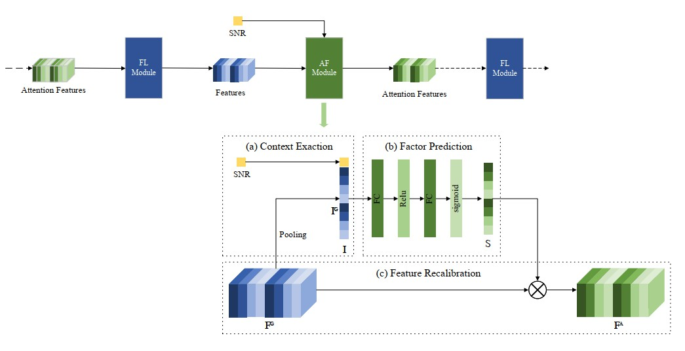
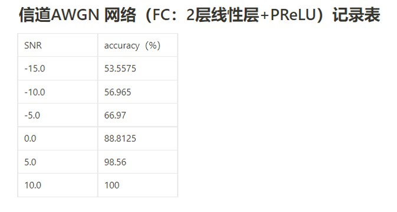

# AI_enabled-Physical-layer-anti-interference
This is a course project in **Principles of Wireless 
Communication and Mobile Networks** (IE304 in SJTU). 
We aim to utilize autoencoder to detect the occurrence 
of disturbances or collisions and avoid them, 
and further realize whole anti-interference communication technology.

## Group Members
**YUZHE ZHANG** (group leader) 

**SHANMU WANG, YOUSONG ZHANG, ZEXI LIU**

**TA: MINGQI XIE**
# Still In Process

## Update 2022.4.10 Next Stage Target
After the base module of autoencoder and various channels has been implemented, 
we need to add appropriate channel detection and feedback modules to our work.

After study of related work, we find a paper ***Wireless Image Transmission Using Deep Source
Channel Coding With Attention Modules***, which propose to exploit some AF modules.
We will endeavor to improve the existing work under the guidance of following illustration.

## Update 2022.3.30 Some experiment results
Here is some display of recent experiment results.
####Figure1. Accurary Under AWGN of Different SNR

